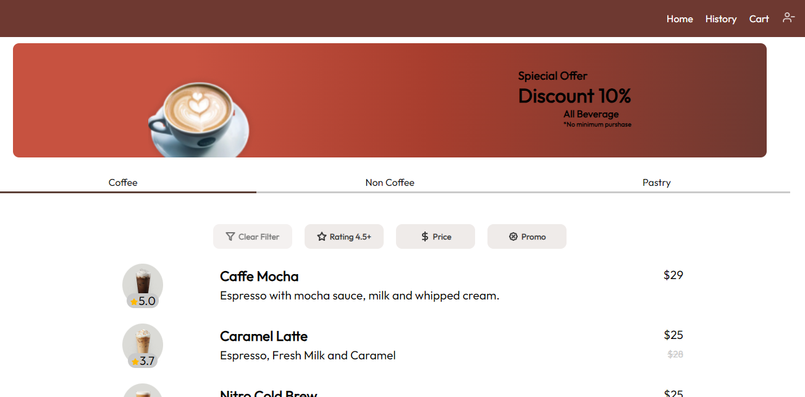

# Coffee Shop in React and Firebase

## About

+ Coffee shop as an online ordering shop which server **Coffees**, **Non-coffees**, **and Pastry**
+ Use Firebase Firestore to store
    - Receipts
    - Products
    - Reviews
    - Checkout
+ Beside Firestore, Firebase Auth is use to
    - Register User
    - Sign in user
    - Sign out User
+ Coffee shop can take immediate order or a schedule order

## Features
+ Error handling so the user never get lost
+ Store each record for user to get them back when require
+ Auth user

## What Customer of Coffee shop can do?
+ Can order
+ leave review and update review
+ schedule their orders
+ Have and Delete their checkouts
+ See their receipts
+ Track their orders
+ View other people reviews

## Installation
+ Get a clone or zip of code
+ Open src directory in an editor
+ `npm install`, `npm run dev` or `yarn run dev`

## Preview

> You have to get your own firebase congif code incase database do not work. In the case make changes to ./src/firebase.js
